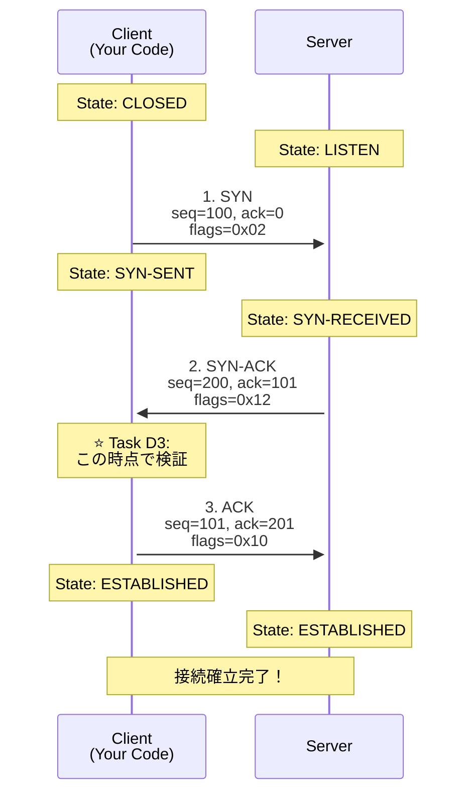

# Step03 学習ログ: 3-way handshake実装

## 学習目標
TCP接続確立の基本プロセス（3-way handshake）を実装し、実際のサーバーとの接続を確立する



## [create_syn_packet等の関数の型設計について]

### 質問内容

途中で議論した、create_syn_packet等の関数の型の設計についてメモを残しておきましょう

### 回答

#### 設計の変遷と議論

**最初の設計（型エラー発生）**：
```rust
fn send_tcp_packet(&self, tcp_header: &TcpHeader, data: &[u8])
fn create_syn_packet(&self) -> Result<Vec<u8>, Box<dyn std::error::Error>>
fn send_syn(&mut self) -> Result<(), Box<dyn std::error::Error>> {
    let syn_packet = self.create_syn_packet();
    self.send_tcp_packet(&syn_packet, &[])?; // ← 型エラー：&Vec<u8> vs &TcpHeader
}
```

**中間案（TcpHeaderを返す設計）**：
```rust
fn create_syn_packet(&self) -> Result<TcpHeader, Box<dyn std::error::Error>>
fn send_syn(&mut self) -> Result<(), Box<dyn std::error::Error>> {
    let syn_header = self.create_syn_packet()?;
    self.send_tcp_packet(&syn_header, &[])?;
}
```

**最終設計（概念的に正しい設計）**：
```rust
fn send_tcp_packet(&self, tcp_header_bytes: &[u8], data: &[u8])
fn create_syn_packet(&self) -> Result<Vec<u8>, Box<dyn std::error::Error>>
fn send_syn(&mut self) -> Result<(), Box<dyn std::error::Error>> {
    let syn_packet = self.create_syn_packet()?;
    self.send_tcp_packet(&syn_packet, &[])?;
}
```

#### 概念的な違いの理解

**TcpHeader（構造体・オブジェクト）**:
- TCPヘッダーの**構造化された表現**
- フィールドに名前でアクセス可能（`header.source_port`など）
- チェックサム計算などの**操作**ができる
- メモリ上での**データ構造**

**Packet（バイト列）**:
- ネットワーク上で**実際に送信される形式**
- バイト配列（`Vec<u8>`や`&[u8]`）
- ワイヤーフォーマット（wire format）
- 直接socket送信可能

#### TCP/IPパケット構造の理解

```
🌐 ネットワーク上で実際に送信される完全なパケット
┌─────────────────────────────────────────────────────────────┐
│                    Complete IP Packet                      │
├──────────────────┬──────────────────┬───────────────────────┤
│   IP Header      │   TCP Header     │   Application Data    │
│   (20 bytes)     │   (20 bytes)     │   (variable length)   │
└──────────────────┴──────────────────┴───────────────────────┘
```

**用語の正確な定義**：
- **IP Packet (IP Datagram)**: IP Header + IP Payload
- **TCP Packet/Segment**: TCP Header + Application Data（IPヘッダー含まず）

#### 最終設計の利点

1. **命名と実装が一致**: 「packet」という名前でバイト列を返す
2. **拡張性**: 将来ACK/FINパケットでも同じパターンが使える
3. **テストの自然さ**: バイト列として直接検証可能
4. **ネットワーク概念の一致**: パケット = 送信可能なバイト列

#### 学んだ重要なポイント

- **概念の分離**: 構造体（操作可能）とバイト列（送信可能）は異なる概念
- **命名の重要性**: 関数名から期待される動作と実装を一致させる
- **設計の一貫性**: 同じパターンを他の種類のパケット作成でも適用可能

## [tcp_packetとtcp_header,ip_headerの関係について]

### 質問内容

tcp_packetとtcp_header,ip_headerの関係をアスキーアートの図にして説明してください

### 回答

#### ネットワーク上で実際に送信される完全なパケット

```
🌐 ネットワーク上で実際に送信される完全なパケット
┌─────────────────────────────────────────────────────────────┐
│                    Complete IP Packet                      │
├──────────────────┬──────────────────┬───────────────────────┤
│   IP Header      │   TCP Header     │   Application Data    │
│   (20 bytes)     │   (20 bytes)     │   (variable length)   │
│                  │                  │                       │
│ Version: 4       │ Src Port: 12345  │ "Hello, World!"       │
│ Protocol: 6(TCP) │ Dst Port: 80     │ "GET / HTTP/1.1"      │
│ Src IP: 10.0.0.1 │ Seq: 1000        │ ...                   │
│ Dst IP: 10.0.0.2 │ ACK: 0           │                       │
│ Length: 53       │ Flags: SYN       │                       │
│ ...              │ Window: 8192     │                       │
│                  │ Checksum: 0x1234 │                       │
└──────────────────┴──────────────────┴───────────────────────┘
```

#### Step3のsend_tcp_packet関数での処理

```
📦 関数内でのパケット構築プロセス

Step 1: 引数として受け取る部分
┌──────────────────┬───────────────────────┐
│   tcp_header_bytes   │      data             │
│   (TCPヘッダー)       │   (アプリケーションデータ)  │
│   [0x30, 0x39,...]  │   "Hello, World!"     │
└──────────────────┴───────────────────────┘

Step 2: IPヘッダーを作成
┌──────────────────┐
│   ip_header      │  ← IpHeader::new()で作成
│   (自動生成)      │
└──────────────────┘

Step 3: 完全パケットに結合
┌──────────────────┬──────────────────┬───────────────────────┐
│   IP Header      │   TCP Header     │   Application Data    │
│   (ip_header)    │(tcp_header_bytes)│      (data)           │
│                  │                  │                       │
│ ← IpHeader::new()│ ← 引数で受け取った │ ← 引数で受け取った      │
│    で自動生成     │   バイト列        │   データ              │
└──────────────────┴──────────────────┴───────────────────────┘
                                ↓
                        send_to_network()
```

#### レイヤー別の「パケット」概念

```
📦 レイヤー別の「パケット」概念

Layer 3 (Network Layer):
┌──────────────────┬──────────────────────────────────────────┐
│   IP Header      │            IP Payload                    │
└──────────────────┴──────────────────────────────────────────┘
│◄─────────────────── IP Packet ──────────────────────────────►│

Layer 4 (Transport Layer):
                   ┌──────────────────┬───────────────────────┐
                   │   TCP Header     │   Application Data    │
                   └──────────────────┴───────────────────────┘
                   │◄──────────── TCP Packet ─────────────────►│
```

#### 用語の関係

```
📋 概念レベル
┌─────────────┐
│ TCP Packet  │ = TCP全体の概念（ヘッダー + データ）
└─────────────┘

🔧 実装レベル  
┌──────────────────┬───────────────────────┐
│  TcpHeader       │  Application Data     │
│  (構造体/バイト列) │  (バイト列)            │
└──────────────────┴───────────────────────┘

🌐 ネットワークレベル
┌──────────────────┬──────────────────┬───────────────────────┐
│   IP Header      │   TCP Header     │   Application Data    │
│   (IP Packet)    │                  │                       │
└──────────────────┴──────────────────┴───────────────────────┘
```

#### 重要な理解ポイント

**TCPパケットの定義**：
- **一般的な使い方**: 「TCPパケット」= TCP Header + Application Data（IPヘッダー含まず）
- **RFC的な正確な定義**: TCP Segment = TCP Header + Application Data

**なぜtcp_header_bytesが正確な命名か**：
```
❌ 不正確: tcp_packet
┌──────────────────┬───────────────────────┐
│   TCP Header     │   Application Data    │  ← 全部まとめて"packet"？
└──────────────────┴───────────────────────┘

✅ 正確: tcp_header_bytes + data  
┌──────────────────┐ ┌───────────────────────┐
│   TCP Header     │ │   Application Data    │
│(tcp_header_bytes)│ │      (data)           │
└──────────────────┘ └───────────────────────┘
       ↑                     ↑
   明確に分離された引数として受け取る
```

## Phase A: 3-way handshakeの理解と設計

### Task A1: RFC 9293 Section 3.5の理解

#### 3-way handshakeのフロー
```
Client                           Server
CLOSED                           LISTEN
  |                                |
  | -- SYN seq=x -->              |
  |                               | 
SYN-SENT                          |
  |                              | -- SYN-ACK seq=y, ack=x+1 -->
  |                           SYN-RECEIVED
  | <-- SYN-ACK seq=y, ack=x+1 --|
  |                               |
  | -- ACK seq=x+1, ack=y+1 -->  |
  |                               |
ESTABLISHED                   ESTABLISHED
```

#### 各パケットの意味
- **SYN**: 接続開始要求。クライアントの初期シーケンス番号(x)を通知
- **SYN-ACK**: 接続受諾 + サーバーの初期シーケンス番号(y) + クライアントのSYNに対するACK(x+1)
- **ACK**: 接続確立完了。サーバーのSYNに対するACK(y+1)

### Task A2: シーケンス番号とACK番号の計算ルール

| パケット | seq番号 | ack番号 | 説明 |
|----------|---------|---------|------|
| SYN | ISN_client (x) | 0 | クライアントの初期シーケンス |
| SYN-ACK | ISN_server (y) | x+1 | サーバーの初期seq + クライアントseqをACK |
| ACK | x+1 | y+1 | 両方のISNをインクリメントしてACK |

#### 重要なポイント
- SYNフラグ自体が1バイト分のデータとして扱われる（seq番号を+1する）
- ACK番号は「次に受信を期待するシーケンス番号」
- ISN（Initial Sequence Number）は安全性のためランダムに生成

### Task A3: 接続状態の理解

```rust
#[derive(Debug, Clone, PartialEq)]
pub enum TcpState {
    Closed,      // 初期状態、接続なし
    SynSent,     // SYN送信済み、SYN-ACK待ち
    Established, // 接続確立完了
}
```

#### 状態遷移
- CLOSED → SYN-SENT: SYNパケット送信時
- SYN-SENT → ESTABLISHED: 正しいSYN-ACK受信後、ACK送信完了時

## [ノンブロッキングの意味とMSG_DONTWAITフラグについて]

### 質問内容

ノンブロッキングの意味がよくわかってないのですが、libc::MSG_DONTWAITを指定することで挙動がどのように変わるのですか？

### 回答

#### MSG_DONTWAITなし（ブロッキング）
```rust
// フラグなし、またはフラグに0を指定
let bytes_received = unsafe {
    libc::recv(
        self.socket_fd,
        buffer.as_mut_ptr() as *mut libc::c_void,
        buffer.len(),
        0, // ブロッキング
    )
};
```

**挙動**:
- パケットが来るまで**無限に待機**
- プログラムがここで**完全に停止**
- パケットが届いたらやっと次の行に進む

#### MSG_DONTWAITあり（ノンブロッキング）
```rust
let bytes_received = unsafe {
    libc::recv(
        self.socket_fd,
        buffer.as_mut_ptr() as *mut libc::c_void,
        buffer.len(),
        libc::MSG_DONTWAIT, // ノンブロッキング
    )
};
```

**挙動**:
- パケットがあれば**即座に受信して返す**
- パケットがなければ**即座にエラーを返す**（待機しない）
- プログラムは絶対に止まらない

#### 実際の処理フロー比較

**ブロッキング版**:
```rust
println!("受信開始...");
let packet = recv(); // ← ここで永久に止まる可能性
println!("パケット受信完了！"); // パケットが来るまで実行されない
```

**ノンブロッキング版**:
```rust
println!("受信開始...");
match recv() {
    Ok(packet) => println!("パケット受信完了！"),
    Err(_) => println!("パケットなし、他の処理を続行"),
}
// 必ずここまで実行される
```

#### receive_packet_timeoutでの活用

```rust
fn receive_packet_timeout(&self, timeout_secs: u64) -> Result<Vec<u8>, Box<dyn std::error::Error>> {
    let start = Instant::now();
    
    loop {
        // ノンブロッキングで受信試行
        match self.try_receive_packet() {
            Ok(data) => return Ok(data),        // パケットがあった
            Err(_) => {                         // パケットがなかった
                if start.elapsed() > timeout {
                    return Err("Timeout".into()); // 制限時間超過
                }
                std::thread::sleep(Duration::from_millis(10)); // 少し待って再試行
            }
        }
    }
}
```

#### なぜノンブロッキングが必要？

**3-way handshakeでは**:
1. SYN送信
2. **5秒以内に**SYN-ACK受信（タイムアウト制御が必要）
3. ACK送信

ブロッキング版だと、SYN-ACKが来ない場合にプログラムが永久に止まってしまいます。

ノンブロッキング版なら、10ms毎にパケットをチェックしつつ、5秒経ったらタイムアウトできます。

## [TCP シーケンス番号管理について]

### 質問内容

どうしてcomplete_handshake関数内でシーケンス番号を+1するのですか？
ACK送信時に+1するのではだめですか？

### 回答

#### なぜ complete_handshake() で local_seq += 1 するのか

**TCP でのシーケンス番号消費ルール**：

TCPでは、以下の場合にシーケンス番号が消費（+1）されます：

1. **SYNフラグ**: 1バイト分のシーケンス番号を消費
2. **FINフラグ**: 1バイト分のシーケンス番号を消費
3. **データ**: データのバイト数分を消費
4. **ACKのみ**: シーケンス番号は消費しない

**3-way handshake での流れ**：

```
Client                           Server
CLOSED                           LISTEN
  |                                |
  | SYN seq=1000 ------------>     |  ← クライアントがSYNを送信
  |                               |
SYN-SENT                          |
  |                              |
  | <---------- SYN-ACK seq=2000, ack=1001  ← サーバーがSYN-ACKを返す
  |                               |
  | ACK seq=1001, ack=2001 --->   |  ← クライアントがACKを送信
  |                               |
ESTABLISHED                   ESTABLISHED
```

**なぜ complete_handshake() で +1 するのか**：

1. **SYN送信時**: `local_seq = 1000` (ISN)
2. **SYN送信後**: SYNフラグが1バイト消費 → 次のseq番号は`1001`になるべき
3. **ACK送信時**: `seq = local_seq + 1 = 1001` で送信
4. **接続確立後**: `local_seq`を実際の現在値`1001`に更新

**具体例での理解**：

```rust
// SYN送信前
self.local_seq = 1000;

// SYN送信（create_syn_packet内）
// seq = 1000 で送信

// ACK送信（create_ack_packet内）
// seq = self.local_seq + 1 = 1001 で送信

// 接続確立完了時
self.local_seq += 1;  // 1000 → 1001
// これで次回のデータ送信時は seq=1001 から開始
```

**重要なポイント**：
SYNフラグは論理的に1バイトのデータとして扱われるため、送信後はシーケンス番号を1つ進める必要があります。これにより、後続のデータ送信で正しいシーケンス番号が使用されます。

#### ACK送信時に+1する案の検討

**現在の実装パターン**：
```rust
// send_ack() - ACK送信時
fn create_ack_packet(&self, ack_number: u32) -> ... {
    TcpHeader::new(
        self.local_port,
        self.remote_port,
        self.local_seq + 1,  // ← ここで+1して送信
        ack_number,
        tcp_flags::ACK,
        8192,
    );
}

// complete_handshake() - 接続確立時
fn complete_handshake(&mut self) {
    self.state = TcpState::Established;
    self.local_seq += 1;  // ← ここで実際の値を更新
}
```

**代替案：ACK送信時に更新**：
```rust
// send_ack() - ACK送信時に更新
fn send_ack(&mut self, ack_number: u32) -> ... {
    self.local_seq += 1;  // ← ここで更新
    let ack_packet = self.create_ack_packet(ack_number)?;
    // ...
}

fn create_ack_packet(&self, ack_number: u32) -> ... {
    TcpHeader::new(
        self.local_port,
        self.remote_port,
        self.local_seq,  // ← 既に更新済みの値を使用
        ack_number,
        tcp_flags::ACK,
        8192,
    );
}
```

**現在の実装の方が良い理由**：

1. **責任の分離**
   - `send_ack()`: パケット送信の責任
   - `complete_handshake()`: 状態管理の責任

2. **再利用性**
   - `create_ack_packet()`が`local_seq`を変更しないので、テストしやすい
   - 複数回呼び出しても副作用がない

3. **タイミングの明確性**
   - 3-way handshake **完了時点** でシーケンス番号を確定
   - パケット送信と状態更新を分離

4. **RFC準拠**
   - TCPの状態遷移とシーケンス番号管理を明確に分離

**結論**：
現在の実装（`complete_handshake()`で更新）が推奨です。なぜなら：

- シーケンス番号の更新は「接続確立完了」という状態変化の一部
- パケット送信機能は副作用を持たない方が安全
- テストや再利用が容易

ただし、ACK送信時に更新する案も技術的には正しく、設計思想の違いと言えます。

## [テストを繰り返すとTimeoutエラーになる問題]

### 事象

テストを何度か繰り返し実行していると、途中からパケットの受信に失敗し、Timeoutエラーが発生する。

**tcpdumpのログから見た挙動**：
- 最初の3回の接続：SYN → SYN-ACK → ACK（成功）
- 4回目以降：SYN送信 → **応答なし**（サーバーからSYN-ACKが返ってこない）

### 原因

**接続終了処理（FIN送信やsocketクローズ）が実装されていないため**、以下の問題が発生：

1. **TCP接続がESTABLISHED状態で残り続ける**
   ```bash
   $ sudo ip netns exec host2 ss -tan | grep 40000
   LISTEN 2      1           10.0.1.1:40000      0.0.0.0:*
   ESTAB  0      0           10.0.1.1:40000     10.0.0.1:40021
   ESTAB  0      0           10.0.1.1:40000     10.0.0.1:37333
   ESTAB  0      0           10.0.1.1:40000     10.0.0.1:37299
   ```
   - `LISTEN 2 1`: 最大バックログ2、現在のキュー1（限界に近い）
   - 3つのESTABLISHED接続が残っている

2. **サーバーのバックログがいっぱいになる**
   - 新しい接続を受け付けられなくなる

3. **socket_fdのリーク**
   - ファイルディスクリプタが解放されていない
   - カーネルのリソースが枯渇

### 根本原因

`TcpConnection`が接続を確立した後、**`socket_fd`をクローズしていない**ため：
- クライアント側のプロセスが終了してもsocketが開いたまま
- サーバー側でESTABLISHED状態の接続が残る
- カーネルによる自動的なFIN送信も行われない

### 回避策（Step03での対応）

接続終了処理（4-way handshake、FIN処理）は**Step 12で学習する内容**のため、Step03では実装しない。

#### 手動クリーンアップ方法

**方法1: ESTABLISHED接続を強制切断（推奨）**
```bash
# host2（サーバー側）のESTABLISHED接続をすべて切断
sudo ip netns exec host2 ss -K dst 10.0.0.1
```

**方法2: サーバー（nc）を再起動**
```bash
# ncプロセスを終了
sudo ip netns exec host2 pkill -f "nc -l"

# サーバーを再起動
sudo ip netns exec host2 nc -l 10.0.1.1 40000 &
```

**方法3: 接続状態を確認してから選択的に切断**
```bash
# 現在の接続状態を確認
sudo ip netns exec host2 ss -tan | grep 40000

# 特定のポートへの接続を切断
sudo ip netns exec host2 ss -K dst 10.0.0.1:37299
```

#### テスト実行前のクリーンアップ

```bash
# クリーンアップしてからテスト実行
sudo ip netns exec host2 ss -K dst 10.0.0.1 && \
sudo RUST_LOG=info ip netns exec host1 \
  target/debug/deps/step03-ea0032633cd6533a \
  test_complete_handshake --nocapture
```

### 将来の実装（Step 12）

Step 12で以下を実装予定：
- `Drop`トレイトによる自動的なsocketクローズ
- FINパケットの送受信
- 4-way handshakeの実装
- TIME_WAIT状態の管理
- 適切なリソース解放

**参考：将来実装するDropトレイト**（Step 12で学習）
```rust
impl Drop for TcpConnection {
    fn drop(&mut self) {
        // socket_fdを安全にクローズ
        if self.socket_fd >= 0 {
            unsafe {
                libc::close(self.socket_fd);
            }
        }
    }
}
```

### 学んだポイント

- TCPは接続指向プロトコルで、**接続確立と接続終了は対になる処理**
- 接続終了処理を実装しないと、カーネルリソースがリークする
- 学習段階では、適切な回避策を使って段階的に実装を進めることが重要
- 本番環境では、必ず接続終了処理を実装する必要がある
