# Step03 学習ログ: 3-way handshake実装

## 学習目標
TCP接続確立の基本プロセス（3-way handshake）を実装し、実際のサーバーとの接続を確立する



## [create_syn_packet等の関数の型設計について]

### 質問内容

途中で議論した、create_syn_packet等の関数の型の設計についてメモを残しておきましょう

### 回答

#### 設計の変遷と議論

**最初の設計（型エラー発生）**：
```rust
fn send_tcp_packet(&self, tcp_header: &TcpHeader, data: &[u8])
fn create_syn_packet(&self) -> Result<Vec<u8>, Box<dyn std::error::Error>>
fn send_syn(&mut self) -> Result<(), Box<dyn std::error::Error>> {
    let syn_packet = self.create_syn_packet();
    self.send_tcp_packet(&syn_packet, &[])?; // ← 型エラー：&Vec<u8> vs &TcpHeader
}
```

**中間案（TcpHeaderを返す設計）**：
```rust
fn create_syn_packet(&self) -> Result<TcpHeader, Box<dyn std::error::Error>>
fn send_syn(&mut self) -> Result<(), Box<dyn std::error::Error>> {
    let syn_header = self.create_syn_packet()?;
    self.send_tcp_packet(&syn_header, &[])?;
}
```

**最終設計（概念的に正しい設計）**：
```rust
fn send_tcp_packet(&self, tcp_header_bytes: &[u8], data: &[u8])
fn create_syn_packet(&self) -> Result<Vec<u8>, Box<dyn std::error::Error>>
fn send_syn(&mut self) -> Result<(), Box<dyn std::error::Error>> {
    let syn_packet = self.create_syn_packet()?;
    self.send_tcp_packet(&syn_packet, &[])?;
}
```

#### 概念的な違いの理解

**TcpHeader（構造体・オブジェクト）**:
- TCPヘッダーの**構造化された表現**
- フィールドに名前でアクセス可能（`header.source_port`など）
- チェックサム計算などの**操作**ができる
- メモリ上での**データ構造**

**Packet（バイト列）**:
- ネットワーク上で**実際に送信される形式**
- バイト配列（`Vec<u8>`や`&[u8]`）
- ワイヤーフォーマット（wire format）
- 直接socket送信可能

#### TCP/IPパケット構造の理解

```
🌐 ネットワーク上で実際に送信される完全なパケット
┌─────────────────────────────────────────────────────────────┐
│                    Complete IP Packet                      │
├──────────────────┬──────────────────┬───────────────────────┤
│   IP Header      │   TCP Header     │   Application Data    │
│   (20 bytes)     │   (20 bytes)     │   (variable length)   │
└──────────────────┴──────────────────┴───────────────────────┘
```

**用語の正確な定義**：
- **IP Packet (IP Datagram)**: IP Header + IP Payload
- **TCP Packet/Segment**: TCP Header + Application Data（IPヘッダー含まず）

#### 最終設計の利点

1. **命名と実装が一致**: 「packet」という名前でバイト列を返す
2. **拡張性**: 将来ACK/FINパケットでも同じパターンが使える
3. **テストの自然さ**: バイト列として直接検証可能
4. **ネットワーク概念の一致**: パケット = 送信可能なバイト列

#### 学んだ重要なポイント

- **概念の分離**: 構造体（操作可能）とバイト列（送信可能）は異なる概念
- **命名の重要性**: 関数名から期待される動作と実装を一致させる
- **設計の一貫性**: 同じパターンを他の種類のパケット作成でも適用可能

## [tcp_packetとtcp_header,ip_headerの関係について]

### 質問内容

tcp_packetとtcp_header,ip_headerの関係をアスキーアートの図にして説明してください

### 回答

#### ネットワーク上で実際に送信される完全なパケット

```
🌐 ネットワーク上で実際に送信される完全なパケット
┌─────────────────────────────────────────────────────────────┐
│                    Complete IP Packet                      │
├──────────────────┬──────────────────┬───────────────────────┤
│   IP Header      │   TCP Header     │   Application Data    │
│   (20 bytes)     │   (20 bytes)     │   (variable length)   │
│                  │                  │                       │
│ Version: 4       │ Src Port: 12345  │ "Hello, World!"       │
│ Protocol: 6(TCP) │ Dst Port: 80     │ "GET / HTTP/1.1"      │
│ Src IP: 10.0.0.1 │ Seq: 1000        │ ...                   │
│ Dst IP: 10.0.0.2 │ ACK: 0           │                       │
│ Length: 53       │ Flags: SYN       │                       │
│ ...              │ Window: 8192     │                       │
│                  │ Checksum: 0x1234 │                       │
└──────────────────┴──────────────────┴───────────────────────┘
```

#### Step3のsend_tcp_packet関数での処理

```
📦 関数内でのパケット構築プロセス

Step 1: 引数として受け取る部分
┌──────────────────┬───────────────────────┐
│   tcp_header_bytes   │      data             │
│   (TCPヘッダー)       │   (アプリケーションデータ)  │
│   [0x30, 0x39,...]  │   "Hello, World!"     │
└──────────────────┴───────────────────────┘

Step 2: IPヘッダーを作成
┌──────────────────┐
│   ip_header      │  ← IpHeader::new()で作成
│   (自動生成)      │
└──────────────────┘

Step 3: 完全パケットに結合
┌──────────────────┬──────────────────┬───────────────────────┐
│   IP Header      │   TCP Header     │   Application Data    │
│   (ip_header)    │(tcp_header_bytes)│      (data)           │
│                  │                  │                       │
│ ← IpHeader::new()│ ← 引数で受け取った │ ← 引数で受け取った      │
│    で自動生成     │   バイト列        │   データ              │
└──────────────────┴──────────────────┴───────────────────────┘
                                ↓
                        send_to_network()
```

#### レイヤー別の「パケット」概念

```
📦 レイヤー別の「パケット」概念

Layer 3 (Network Layer):
┌──────────────────┬──────────────────────────────────────────┐
│   IP Header      │            IP Payload                    │
└──────────────────┴──────────────────────────────────────────┘
│◄─────────────────── IP Packet ──────────────────────────────►│

Layer 4 (Transport Layer):
                   ┌──────────────────┬───────────────────────┐
                   │   TCP Header     │   Application Data    │
                   └──────────────────┴───────────────────────┘
                   │◄──────────── TCP Packet ─────────────────►│
```

#### 用語の関係

```
📋 概念レベル
┌─────────────┐
│ TCP Packet  │ = TCP全体の概念（ヘッダー + データ）
└─────────────┘

🔧 実装レベル  
┌──────────────────┬───────────────────────┐
│  TcpHeader       │  Application Data     │
│  (構造体/バイト列) │  (バイト列)            │
└──────────────────┴───────────────────────┘

🌐 ネットワークレベル
┌──────────────────┬──────────────────┬───────────────────────┐
│   IP Header      │   TCP Header     │   Application Data    │
│   (IP Packet)    │                  │                       │
└──────────────────┴──────────────────┴───────────────────────┘
```

#### 重要な理解ポイント

**TCPパケットの定義**：
- **一般的な使い方**: 「TCPパケット」= TCP Header + Application Data（IPヘッダー含まず）
- **RFC的な正確な定義**: TCP Segment = TCP Header + Application Data

**なぜtcp_header_bytesが正確な命名か**：
```
❌ 不正確: tcp_packet
┌──────────────────┬───────────────────────┐
│   TCP Header     │   Application Data    │  ← 全部まとめて"packet"？
└──────────────────┴───────────────────────┘

✅ 正確: tcp_header_bytes + data  
┌──────────────────┐ ┌───────────────────────┐
│   TCP Header     │ │   Application Data    │
│(tcp_header_bytes)│ │      (data)           │
└──────────────────┘ └───────────────────────┘
       ↑                     ↑
   明確に分離された引数として受け取る
```

## Phase A: 3-way handshakeの理解と設計

### Task A1: RFC 9293 Section 3.5の理解

#### 3-way handshakeのフロー
```
Client                           Server
CLOSED                           LISTEN
  |                                |
  | -- SYN seq=x -->              |
  |                               | 
SYN-SENT                          |
  |                              | -- SYN-ACK seq=y, ack=x+1 -->
  |                           SYN-RECEIVED
  | <-- SYN-ACK seq=y, ack=x+1 --|
  |                               |
  | -- ACK seq=x+1, ack=y+1 -->  |
  |                               |
ESTABLISHED                   ESTABLISHED
```

#### 各パケットの意味
- **SYN**: 接続開始要求。クライアントの初期シーケンス番号(x)を通知
- **SYN-ACK**: 接続受諾 + サーバーの初期シーケンス番号(y) + クライアントのSYNに対するACK(x+1)
- **ACK**: 接続確立完了。サーバーのSYNに対するACK(y+1)

### Task A2: シーケンス番号とACK番号の計算ルール

| パケット | seq番号 | ack番号 | 説明 |
|----------|---------|---------|------|
| SYN | ISN_client (x) | 0 | クライアントの初期シーケンス |
| SYN-ACK | ISN_server (y) | x+1 | サーバーの初期seq + クライアントseqをACK |
| ACK | x+1 | y+1 | 両方のISNをインクリメントしてACK |

#### 重要なポイント
- SYNフラグ自体が1バイト分のデータとして扱われる（seq番号を+1する）
- ACK番号は「次に受信を期待するシーケンス番号」
- ISN（Initial Sequence Number）は安全性のためランダムに生成

### Task A3: 接続状態の理解

```rust
#[derive(Debug, Clone, PartialEq)]
pub enum TcpState {
    Closed,      // 初期状態、接続なし
    SynSent,     // SYN送信済み、SYN-ACK待ち
    Established, // 接続確立完了
}
```

#### 状態遷移
- CLOSED → SYN-SENT: SYNパケット送信時
- SYN-SENT → ESTABLISHED: 正しいSYN-ACK受信後、ACK送信完了時

## [ノンブロッキングの意味とMSG_DONTWAITフラグについて]

### 質問内容

ノンブロッキングの意味がよくわかってないのですが、libc::MSG_DONTWAITを指定することで挙動がどのように変わるのですか？

### 回答

#### MSG_DONTWAITなし（ブロッキング）
```rust
// フラグなし、またはフラグに0を指定
let bytes_received = unsafe {
    libc::recv(
        self.socket_fd,
        buffer.as_mut_ptr() as *mut libc::c_void,
        buffer.len(),
        0, // ブロッキング
    )
};
```

**挙動**:
- パケットが来るまで**無限に待機**
- プログラムがここで**完全に停止**
- パケットが届いたらやっと次の行に進む

#### MSG_DONTWAITあり（ノンブロッキング）
```rust
let bytes_received = unsafe {
    libc::recv(
        self.socket_fd,
        buffer.as_mut_ptr() as *mut libc::c_void,
        buffer.len(),
        libc::MSG_DONTWAIT, // ノンブロッキング
    )
};
```

**挙動**:
- パケットがあれば**即座に受信して返す**
- パケットがなければ**即座にエラーを返す**（待機しない）
- プログラムは絶対に止まらない

#### 実際の処理フロー比較

**ブロッキング版**:
```rust
println!("受信開始...");
let packet = recv(); // ← ここで永久に止まる可能性
println!("パケット受信完了！"); // パケットが来るまで実行されない
```

**ノンブロッキング版**:
```rust
println!("受信開始...");
match recv() {
    Ok(packet) => println!("パケット受信完了！"),
    Err(_) => println!("パケットなし、他の処理を続行"),
}
// 必ずここまで実行される
```

#### receive_packet_timeoutでの活用

```rust
fn receive_packet_timeout(&self, timeout_secs: u64) -> Result<Vec<u8>, Box<dyn std::error::Error>> {
    let start = Instant::now();
    
    loop {
        // ノンブロッキングで受信試行
        match self.try_receive_packet() {
            Ok(data) => return Ok(data),        // パケットがあった
            Err(_) => {                         // パケットがなかった
                if start.elapsed() > timeout {
                    return Err("Timeout".into()); // 制限時間超過
                }
                std::thread::sleep(Duration::from_millis(10)); // 少し待って再試行
            }
        }
    }
}
```

#### なぜノンブロッキングが必要？

**3-way handshakeでは**:
1. SYN送信
2. **5秒以内に**SYN-ACK受信（タイムアウト制御が必要）
3. ACK送信

ブロッキング版だと、SYN-ACKが来ない場合にプログラムが永久に止まってしまいます。

ノンブロッキング版なら、10ms毎にパケットをチェックしつつ、5秒経ったらタイムアウトできます。
